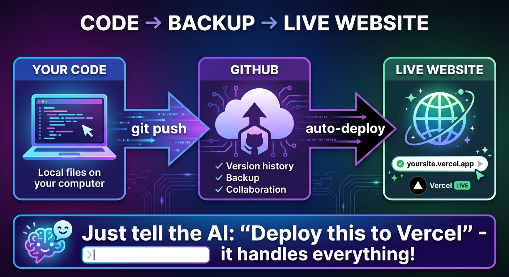
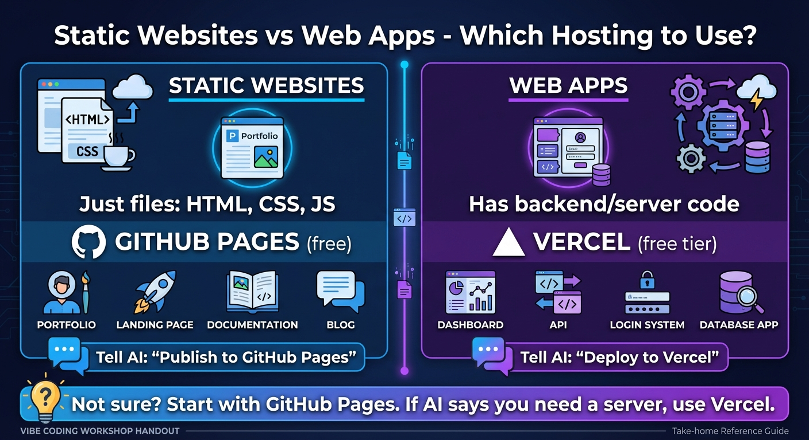
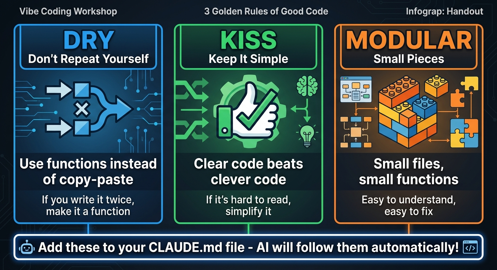
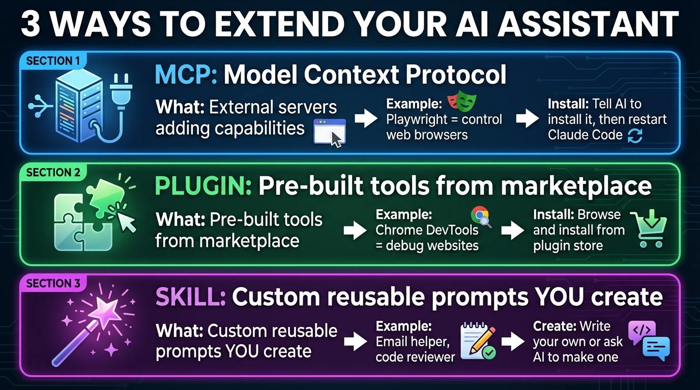

# Workshop Takeaways & Home Setup Guide

**Created:** December 12, 2025
**Workshop:** Franz Enzenhofer Vibe Coding Workshop

---

## What You Can Now Do


After this workshop, you can:

- **Build websites and games** using AI as your coding partner
- **Publish projects online** for free using GitHub + Vercel
- **Process documents and data** (PDFs, spreadsheets, web scraping)
- **Automate tasks** (email monitoring, scheduled scripts)
- **Extend AI capabilities** with MCPs, plugins, and custom skills

---

## Part 1: Setting Up At Home

### Install Claude Code

**Mac (choose one):**
```bash
# Option 1: Install script (recommended)
curl -fsSL https://claude.ai/install.sh | bash

# Option 2: Homebrew
brew install --cask claude-code

# Option 3: npm (requires Node.js 18+)
npm install -g @anthropic-ai/claude-code
```

**Windows (PowerShell):**
```powershell
irm https://claude.ai/install.ps1 | iex
```

**Official docs:** [code.claude.com/docs](https://code.claude.com/docs/en/overview)

---

### Install OpenAI Codex (Alternative)

**Mac/Linux (choose one):**
```bash
# Option 1: npm (requires Node.js 18+)
npm install -g @openai/codex

# Option 2: Homebrew (Mac only)
brew install --cask codex
```

**Windows:** Experimental support - use WSL (Windows Subsystem for Linux) for best results.

**Official docs:** [github.com/openai/codex](https://github.com/openai/codex)

---

### Login Options

#### Option A: Browser Login (Easiest)

Just run the tool - it opens your browser to log in:

- **Claude Code:**
  ```bash
  claude
  ```

- **OpenAI Codex:**
  ```bash
  codex
  ```

#### Option B: API Key Login

**Step 1:** Get your API key:

- Claude Code: [console.anthropic.com](https://console.anthropic.com/settings/keys)
- Codex: [platform.openai.com](https://platform.openai.com/api-keys)

**Step 2:** Set your API key (copy, replace YOUR_KEY_HERE, paste in terminal):

**Mac/Linux:**
```bash
# For Claude Code - paste this, then run claude
export ANTHROPIC_API_KEY="YOUR_KEY_HERE"
```
```bash
# For Codex - paste this, then run codex
export OPENAI_API_KEY="YOUR_KEY_HERE"
```

**Windows PowerShell:**
```powershell
# For Claude Code - paste this, then run claude
$env:ANTHROPIC_API_KEY="YOUR_KEY_HERE"
```
```powershell
# For Codex - paste this, then run codex
$env:OPENAI_API_KEY="YOUR_KEY_HERE"
```

**Step 3:** Now run the tool:

- **Claude Code:**
  ```bash
  claude
  ```

- **OpenAI Codex:**
  ```bash
  codex
  ```

**Problems?** Copy your error message and ask ChatGPT or Claude.ai:
> "I'm getting this error: [paste error]. How do I fix it?"

---

### YOLO Mode (Skip Permission Prompts)

Copy and paste these to skip all "are you sure?" prompts:

**Claude Code - YOLO mode:**
```bash
claude --dangerously-skip-permissions
```

**Claude Code - YOLO + continue last session:**
```bash
claude --dangerously-skip-permissions --continue
```

**Codex - Full YOLO mode:**
```bash
codex --yolo
```

**Codex - Moderate mode (asks only on failures):**
```bash
codex --full-auto
```

**Want shorter commands?** Ask AI to create aliases for you:

**Mac/Linux - copy and paste this prompt:**
```
Create permanent shell aliases for me: claude+ for Claude Code YOLO mode, claude++ for YOLO with continue, codex+ for Codex YOLO. Detect which shell I use and add them to the correct config file so they work every time I open terminal.
```

**Windows PowerShell - copy and paste this prompt:**
```
Create permanent PowerShell aliases for me: claude+ for Claude Code YOLO mode, claude++ for YOLO with continue, codex+ for Codex YOLO. Add them to my PowerShell profile so they work every time I open PowerShell.
```

---

## Part 2: Memory File Template (CLAUDE.md / AGENTS.md)

This file tells AI who you are and how to work. Both tools use the same concept - just different filenames!

**To create your memory file, just type inside the AI tool:**
```
/init
```

Or ask the AI: "Create a global CLAUDE.md (or AGENTS.md) file for me with my preferences."

### Starter Template (Customize for Yourself)

```markdown
# My AI Coding Config

## About Me
- Non-technical user learning to code with AI
- Focus: Web projects, automation, data processing
- Explain things simply, I'm still learning

## My API Keys (KEEP PRIVATE!)
# ANTHROPIC_API_KEY=sk-ant-...
# OPENAI_API_KEY=sk-...
# GEMINI_API_KEY=AIza...
# GITHUB_TOKEN=ghp_...

## Safety Rules - ALWAYS FOLLOW
- NEVER delete entire directories - move to Trash instead
- ALWAYS use git commits before major changes
- NEVER expose API keys in code pushed to GitHub
- ASK before running destructive commands (rm -rf, DROP TABLE, etc.)

## Code Practices
- Keep it simple (KISS) - readable > clever
- Don't repeat code (DRY) - use functions
- MODULAR - small files, small functions, easy to understand
- Add comments only for complex logic

## Debugging Rules
- Always check console/terminal for errors first
- Use console.log() or print() to trace issues
- Read error messages carefully - they tell you what's wrong
- Google the exact error message if stuck

## Git Workflow
- Commit often with clear messages
- Push to GitHub = backup!
- Never force push to main

## Project Structure Preferences
- Keep related files together
- Use clear, descriptive names
- README.md in every project
```

**Keep it under 100 lines.** The AI reads this every time - shorter = better.

---

## Part 3: Services We Used (And Why)

### GitHub (Free)



**What:** Cloud storage for code
**Why we use it:**

- **Version control** - Go back to any previous version if you break something
- **Backup** - Your code is safe even if your computer dies
- **Free static hosting** - GitHub Pages can host simple websites
- **Portfolio** - Show your work to others

**Just tell the AI:**
```
Commit my changes to GitHub with a good commit message
```
```
Push my code to GitHub for backup
```
```
Show me the git history / undo my last change
```

**Pro tip:** Add this to your CLAUDE.md or AGENTS.md so the AI always remembers:
```
Always commit important changes to GitHub for backup and potential rollback.
```

**Get started:** [github.com](https://github.com) (sign up free)

---

### GitHub Pages (Free) - For Static Websites



**What:** Free hosting for simple HTML/CSS/JS websites
**Best for:** Portfolio sites, landing pages, documentation, simple projects

**Just tell the AI:**
```
Publish this website to GitHub Pages
```

---

### Vercel (Free tier) - For Apps
**What:** Free hosting for web applications with backend features
**Best for:** React apps, Next.js, dynamic websites, apps with APIs

**Just tell the AI:**
```
Deploy this app to Vercel
```

**Which one to use?**

- **Static website** (just HTML/CSS/JS files) → GitHub Pages
- **App with backend/API** → Vercel

---

### Command Line Email (Optional)
**What:** Send/receive email from terminal
**Why useful:**
- Automate email responses
- Monitor inbox with scripts
- No GUI needed for server tasks

**Tools:** Himalaya CLI, mutt, or similar
**Requires:** Email account credentials (app password for Gmail)

---

## Part 4: What You Learned (Quick Reference)

### Terminal Basics

| Command | What it does | How to remember |
|---------|--------------|-----------------|
| `pwd` | Shows current folder | "Print Working Directory" |
| `ls` | Lists files here | "List Stuff" |
| `cd folder` | Go into folder | "Change Directory" |
| `cd ..` | Go back one level | ".." means parent |
| `TAB` | Autocomplete! | Just press TAB |

**Forgot a command?** Ask AI: *"What's the terminal command to [what you want to do]?"*

---

### Inside Claude Code

| Command | What it does |
|---------|--------------|
| `/help` | Show all commands |
| `/init` | Create CLAUDE.md for project |
| `/compact` | Compress conversation (save memory) |
| `/clear` | Start fresh |
| `/cost` | Show token usage |
| `/model` | Switch AI model |
| `/mcp` | Manage MCP servers |

**Context Window:** AI's short-term memory. Use `/compact` when conversations get long.

---

### Git Essentials

**Just tell the AI what you want:**

| What you want | Say this |
|---------------|----------|
| See what changed | "What files did I change?" |
| Save your work | "Commit my changes" |
| Backup to GitHub | "Push to GitHub" |
| Get latest code | "Pull from GitHub" |
| See history | "Show git history" |
| Undo changes | "Undo my last commit" |

**Golden rule:** Tell the AI to commit before trying something risky. You can always go back!

---

### Coding Principles



Add this to your CLAUDE.md or AGENTS.md so the AI writes good code:
```
Follow these coding principles:
- DRY (Don't Repeat Yourself) - use functions instead of repeating code
- KISS (Keep It Simple) - clear code beats clever code
- MODULAR - small files, small functions, easy to understand
```

---

### Extending Your AI: MCP vs Plugin vs Skill



There are 3 ways to add capabilities to your AI assistant. Each works differently:

| Type | What it is | Best for |
|------|------------|----------|
| **MCP** | External server adding capabilities | Browser automation, databases, APIs |
| **Plugin** | Pre-built tool from marketplace | Debugging, DevTools, quick installs |
| **Skill** | Custom reusable prompt you create | Your own workflows, repeated tasks |

---

### How to Use MCPs (Model Context Protocol)

**What:** MCPs are external servers that give your AI new superpowers - like controlling browsers, accessing databases, or connecting to external services.

---

### Workshop Recommended MCPs

#### 1. Playwright MCP (Browser Automation)

**What it does:** Control web browsers automatically - take screenshots, fill forms, click buttons, scrape data.

**Install via CLI (recommended):**
```bash
claude mcp add playwright -- npx @playwright/mcp@latest
```

**Or tell the AI:**
```
Install the Playwright MCP from https://github.com/microsoft/playwright-mcp
```

**Then restart Claude Code:**
```
/exit
```
```bash
claude
```

**Example uses:**
```
Take a screenshot of google.com
```
```
Fill out the login form on mysite.com
```
```
Scrape all product prices from this shopping page
```

**GitHub:** [github.com/microsoft/playwright-mcp](https://github.com/microsoft/playwright-mcp)

---

#### 2. Chrome DevTools MCP (Website Debugging)

**What it does:** Debug websites directly from Claude Code - inspect elements, view console errors, monitor network requests.

**Install via CLI:**
```bash
claude mcp add chrome-devtools -- npx chrome-devtools-mcp@latest
```

**Or tell the AI:**
```
Install the Chrome DevTools MCP
```

**Then restart Claude Code:**
```
/exit
```
```bash
claude
```

**Example uses:**
```
Open DevTools and inspect my website
```
```
Show me the console errors on this page
```
```
Check what network requests this page is making
```

**GitHub:** [github.com/anthropics/claude-code-devtools](https://github.com/anthropics/claude-code-devtools)

---

#### 3. SimpleMessage MCP (Custom - from workshop)

**What it does:** Send and receive messages via the SimpleMessage API - a demo of creating your own MCP.

**API Documentation:** [simplemessage.franzai.com/api/docs](https://simplemessage.franzai.com/api/docs)

**Tell the AI to create it:**
```
Create an MCP server for SimpleMessage. Read the API docs at https://simplemessage.franzai.com/api/docs and create an MCP that can post and read messages.
```

---

### Quick MCP Commands Reference

| Command | What it does |
|---------|--------------|
| `claude mcp add NAME -- COMMAND` | Install an MCP |
| `claude mcp list` | List installed MCPs |
| `claude mcp remove NAME` | Remove an MCP |
| `/mcp` | Interactive MCP menu (inside Claude Code) |

**Important:** After installing any MCP, you MUST restart Claude Code with `/exit` then `claude`

**Official MCP docs:** [modelcontextprotocol.io](https://modelcontextprotocol.io)

---

### How to Use Plugins

**What:** Plugins are pre-built tools you can install from a marketplace. Easier than MCPs - no server setup needed.

**Popular Plugins:**

- **Chrome DevTools** - Debug websites directly from Claude Code
- **GitHub** - Enhanced GitHub integration
- **Vercel** - Deployment helpers

**How to install a plugin:**

**Step 1:** Browse available plugins:
```
/plugins
```
or tell the AI:
```
Show me available plugins
```

**Step 2:** Install what you need:
```
Install the Chrome DevTools plugin
```

**Step 3:** Use it immediately (no restart needed for most plugins):
```
Open Chrome DevTools and inspect this page
```

**The difference from MCPs:** Plugins are simpler - they're bundled and ready to use. MCPs are more powerful but need more setup.

---

### How to Create Skills

**What:** Skills are custom reusable prompts YOU create. Think of them as saved instructions that the AI remembers.

**Why create skills?**

- Save time on repeated tasks
- Ensure consistent behavior
- Create your own workflows

**How to create a skill:**

**Step 1:** Tell the AI to create one:
```
Create a skill called "code-review" that reviews my code for bugs, security issues, and suggests improvements. Save it so I can use it anytime.
```

**Step 2:** The AI creates a skill file in `.claude/skills/`

**Step 3:** Use your skill anytime:
```
/code-review
```
or
```
Use the code-review skill on my current file
```

**Example skills to create:**
```
Create a skill that writes git commit messages in a consistent format
```
```
Create a skill that generates unit tests for any function I select
```
```
Create a skill that explains code to beginners
```

**Pro tip:** Add to your CLAUDE.md file:
```
When I say "review this", use the code-review skill automatically.
```

---

### API Key Security

**Tell the AI:**
```
Never put API keys directly in code. Use environment variables and keep them safe.
```

**Pro tip:** Add this to your CLAUDE.md or AGENTS.md so the AI always remembers:
```
Never expose API keys in code. Always use environment variables and add .env to .gitignore.
```

---

## Part 5: How to Continue Learning

### Just Tell The AI To Do It

**Don't ask how - just tell it what you want:**

- "Create a new git repository for this project"
- "Install the Playwright MCP" (then type `/exit` and restart)
- "Deploy this to Vercel"
- "Fix this error: [paste error message]"

### Practice Projects

Start simple, add complexity:

1. **Personal website** - HTML/CSS, deploy to Vercel
2. **Quiz game** - JavaScript, local storage
3. **Data dashboard** - Load CSV, create charts
4. **Email automation** - Monitor inbox, auto-respond

### Keep Learning

- **Claude Code docs:** [code.claude.com/docs](https://code.claude.com/docs/en/overview)
- **GitHub guides:** [docs.github.com](https://docs.github.com/en/get-started)
- **Vercel docs:** [vercel.com/docs](https://vercel.com/docs)
- **MDN Web Docs:** [developer.mozilla.org](https://developer.mozilla.org) (HTML/CSS/JS reference)

---

## Quick Reference Card

### Start AI Coding (type in terminal)
- `claude` → Start Claude Code
- `claude --dangerously-skip-permissions` → YOLO mode
- `codex --yolo` → Codex YOLO mode

### Navigate (before AI is running)
- `cd folder` → Go to folder
- `cd ..` → Go back
- `pwd` → Where am I?
- `ls` → What's here?
- `TAB` → Autocomplete!

### Tell The AI (once running)
- "Commit my changes to GitHub"
- "Push to GitHub for backup"
- "Undo my last change"
- "Deploy this to Vercel"

### Slash Commands (inside Claude Code)
- `/help` → Show commands
- `/init` → Create CLAUDE.md
- `/compact` → Save memory
- `/clear` → Start fresh
- `/cost` → Token usage
- `/exit` → Exit (needed after installing MCP)

### Remember
- Tell AI to commit before risky changes (you can always go back!)
- Never put API keys in code pushed to GitHub
- Just tell the AI what you want - that's what it's for!

---

## Official Documentation Links

| Resource | Link |
|----------|------|
| Claude Code Docs | [code.claude.com/docs](https://code.claude.com/docs/en/overview) |
| Claude Code CLI Reference | [cli-reference](https://code.claude.com/docs/en/cli-reference) |
| Claude Code GitHub | [github.com/anthropics/claude-code](https://github.com/anthropics/claude-code) |
| OpenAI Codex | [github.com/openai/codex](https://github.com/openai/codex) |
| Codex CLI Reference | [developers.openai.com](https://developers.openai.com/codex/cli/reference/) |
| GitHub | [github.com](https://github.com) |
| Vercel | [vercel.com](https://vercel.com) |
| Node.js | [nodejs.org](https://nodejs.org) |
| MCP Protocol | [modelcontextprotocol.io](https://modelcontextprotocol.io) |

---

**You did it!** Now go build something. Start simple, ask AI for help, and keep practicing.

*Franz Enzenhofer Vibe Coding Workshop*
